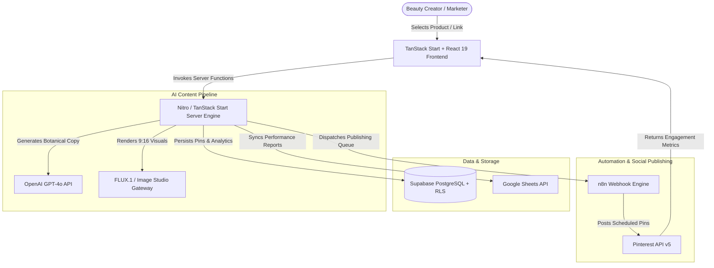

# DailyVerse AI — Automated Pinterest Content & Marketing Platform

[](https://verse-automator.pages.dev)
[](https://tanstack.com/start)
[](https://supabase.com)
[](https://www.typescriptlang.org)

DailyVerse AI is an enterprise-grade, end-to-end content automation platform designed for luxury skincare affiliate marketers and creators. It automates product link discovery, botanical copywriting, 9:16 vertical visual rendering, and scheduled board syndication directly to Pinterest.

---

## 🎯 The Problem & The Solution

### The Problem
Beauty affiliate creators spend **15+ hours per week** manually performing repetitive marketing tasks:
- Designing vertical 9:16 Pinterest pin graphics individually in design software.
- Writing SEO-optimized botanical descriptions, titles, and niche hashtags.
- Manually posting and scheduling content across multiple Pinterest boards.

### The Solution
DailyVerse AI provides an automated, unified SaaS pipeline:
- **One-Click Generation:** Input any skincare product URL or formula to generate publication-ready assets in under 60 seconds.
- **AI Visual Studio:** Renders studio-grade 9:16 vertical graphics tuned with soft lighting, organic botanical textures, and editorial typography.
- **Automated Syndication:** Schedules and syndicate content directly to Pinterest boards via Pinterest API v5 & n8n webhook automation.

---

## 🏗️ System Architecture



---

## ✨ Key Technical Features

- **Full-Stack Server Side Rendering (SSR):** Built with TanStack Start, React 19, and Vite 8 for instant initial loads and full SEO indexing.
- **Automated Copywriting Engine:** Generates high-CTR search titles, botanical descriptions, and targeted SEO hashtags.
- **Studio 9:16 Visual Studio:** Produces luxury skincare imagery with customized brand colors, lighting presets, and typography overlays.
- **n8n & Webhook Syndication:** Asynchronous queue processing for board scheduling and automated social publishing.
- **Supabase Authentication & RLS:** Secure multi-tenant database access controls with Row Level Security (RLS).
- **Creator Growth Analytics:** Real-time metrics dashboard tracking affiliate click-throughs, pin saves, and impression trends.

---

## 🧠 Engineering Challenges & Solutions

| Challenge | Solution Implemented |
| :--- | :--- |
| **High latency when running multi-model AI workflows (GPT-4o copy + FLUX image generation)** | Decoupled asset generation from synchronous API responses using asynchronous background queues and Supabase realtime status indicators. |
| **Pinterest API rate limits & token expiration during bulk syndication** | Built automated OAuth 2.0 refresh token rotation and webhooks via n8n to queue scheduled pin posts safely within rate boundaries. |
| **Maintaining visual consistency with luxury skincare brand standards** | Created a centralized design token system in TailwindCSS v4 with dedicated color variables for forest emerald (`#1e4734`), warm gold (`#c8a96a`), and cream (`#f8f6f2`). |

---

## 🛠️ Tech Stack Matrix

- **Frontend:** React 19, TanStack Start, Vite 8, TailwindCSS v4, Framer Motion v13, Lucide Icons
- **Backend & Server Engine:** TanStack Start Server Functions, Nitro Server, Node.js 22, REST APIs
- **Database & Auth:** Supabase PostgreSQL, Supabase Auth (JWT), Row Level Security (RLS)
- **AI & Automation:** OpenAI GPT-4o API, FLUX.1 Image Engine, n8n Automation Engine
- **Integrations:** Pinterest API v5 (OAuth 2.0), Google Sheets API
- **Deployment:** Cloudflare Pages / Wrangler Worker Engine

---

## ⚙️ Environment Variable Guide

To run DailyVerse AI locally or in production, configure the following environment variables (never commit real keys to Git):

```env
# 1. SUPABASE CONFIGURATION
VITE_SUPABASE_URL="https://your-project-ref.supabase.co"
VITE_SUPABASE_ANON_KEY="your-supabase-anon-key"
SUPABASE_SERVICE_ROLE_KEY="your-supabase-service-role-key"

# 2. OPENAI API CONFIGURATION
OPENAI_API_KEY="sk-proj-your-openai-api-key"

# 3. PINTEREST DEVELOPER APP CONFIGURATION
PINTEREST_CLIENT_ID="your_pinterest_client_id"
PINTEREST_CLIENT_SECRET="your_pinterest_client_secret"
PINTEREST_REDIRECT_URI="https://yourdomain.com/api/pinterest/callback"

# 4. n8n AUTOMATION & WEBHOOK SECURITY
N8N_API_KEY="your_secure_n8n_api_key"
```

---

## 🚀 Getting Started

### Prerequisites
- Node.js >= 20.0.0
- npm >= 10.0.0

### Installation
```bash
# Clone the repository
git clone https://github.com/jisssz/verse-automator.git
cd verse-automator

# Install dependencies
npm install

# Start local development server
npm run dev
```

### Production Build & Type Check
```bash
# Verify TypeScript types
npx tsc --noEmit

# Run ESLint check
npm run lint

# Build production bundle
npm run build
```

---

## 📜 License & Author

Developed by **Jis Shajan** ([@jisssz](https://github.com/jisssz)) — Computer Science & Data Science Student.
